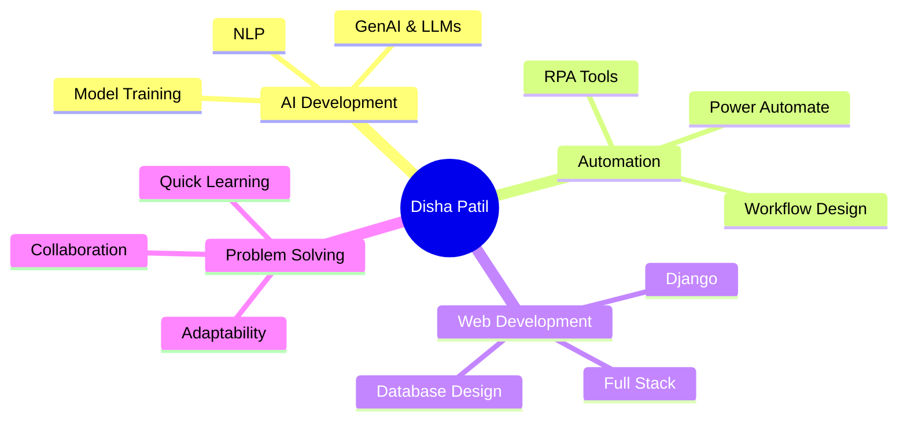

#  Hey there, I'm Disha Patil!

<div align="center">
  
[](https://git.io/typing-svg)

</div>

---


### 🚀 About Me

🎓 **AI & ML Engineer** | Saraswati College of Engineering  
🤖 Building intelligent systems that make a difference  
⚡ Passionate about **RPA, NLP & GenAI**  
🌱 Currently exploring **LLMs & Advanced AI Workflows**  
💡 Always ready to collaborate on innovative projects  

<br/>

### 🌐 Connect With Me

<p align="left">
<a href="http://linkedin.com/in/dishaaap" target="_blank"></a>
<a href="mailto:disha.patil404@gmail.com"></a>
<a href="tel:7276819303"></a>
</p>

---

## 🛠️ Tech Arsenal

<details open>
<summary><b>💻 Languages & Core Skills</b></summary>
<br/>


</details>

<details open>
<summary><b>🌐 Web Development</b></summary>
<br/>


</details>

<details open>
<summary><b>🤖 AI & Automation</b></summary>
<br/>


</details>

<details open>
<summary><b>💾 Databases</b></summary>
<br/>


</details>

---

## 🎯 Featured Projects

<div align="center">

### 🚨 Aberto EMS - AI Emergency Response System
**Saving lives with AI-driven emergency assistance**

```python
emergency_system = {
    "response_time_reduction": "20%",
    "features": ["AI Chatbot", "First-Aid Guidance", "Emergency Dispatch"],
    "impact": "Faster emergency response & immediate assistance"
}
```

**Tech Stack:** `Python` `Django` `AI/LLM` `JavaScript` `HTML/CSS`

---

### 🍕 Food Ordering Platform
**Seamless dining experience at your fingertips**

```python
features = [
    "Dynamic Menu Browsing",
    "Smart Cart Management",
    "Efficient Order Processing",
    "Intuitive UI/UX"
]
```

**Tech Stack:** `Python` `Django` `SQL` `HTML/CSS`

---

### ✈️ AI Travel Itinerary Generator
**Your personal AI travel planner**

```python
travel_ai = {
    "capabilities": ["Budget Planning", "Day-wise Itineraries", "Smart Recommendations"],
    "tech": ["GANs", "Model Evaluation", "SQLite Database"],
    "outcome": "Personalized travel experiences"
}
```

**Tech Stack:** `Python` `Django` `GANs` `SQLite` `AI Models`

</div>

---

## 💼 Professional Experience

### 🔧 Automation Intern @ 3 A Solutions
**Sept 2024 - Dec 2024**

- Architected automated workflows using **Microsoft Power Automate**
- Optimized existing automation flows for enhanced efficiency
- Reduced manual effort and processing errors significantly

---

## 📊 GitHub Stats

<div align="center">
  


</div>

---

## 🏆 Certifications & Achievements

<div align="center">

| Certificate | Provider | Focus Area |
|-------------|----------|------------|
| 🐍 Python & IoT Training | ExcelR | Programming & IoT |
| ☕ Java Programming | Spoken Tutorial | Software Development |
| 🔐 Cybersecurity | NPTEL | Security & Protection |

</div>

---

## 📈 Contribution Graph

[](https://github.com/YOUR_GITHUB_USERNAME)

---

## 💡 Core Competencies

<div align="center">



</div>

---

## 🎯 Current Focus

- 🔭 Working on advanced **AI-driven automation** projects
- 🌱 Learning **LangChain** and **RAG** implementations
- 👯 Open to collaborating on **innovative AI solutions**
- 💬 Ask me about **Python, Django, RPA, or AI workflows**

---

## 📫 Let's Build Something Amazing Together!

<div align="center">

**"Innovation distinguishes between a leader and a follower."**


### ⭐ From [Disha Patil](https://github.com/YOUR_GITHUB_USERNAME) | Making AI Accessible & Impactful ⚡

</div>
